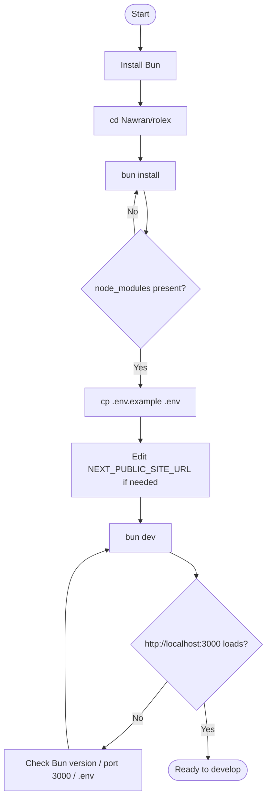
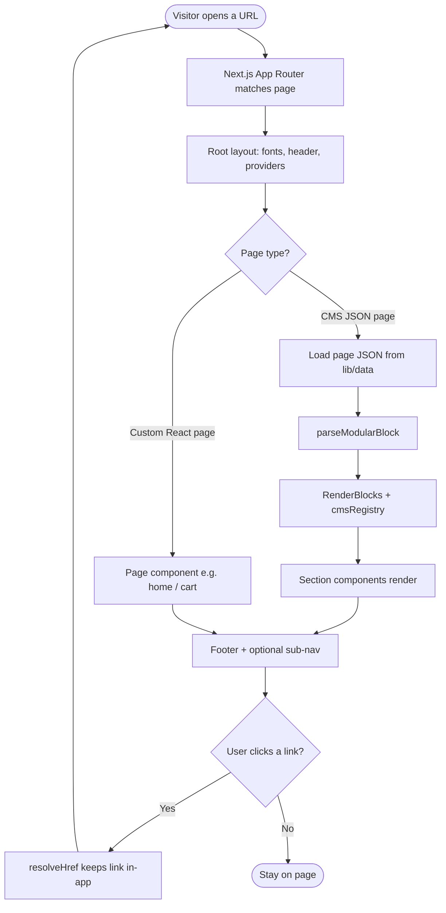
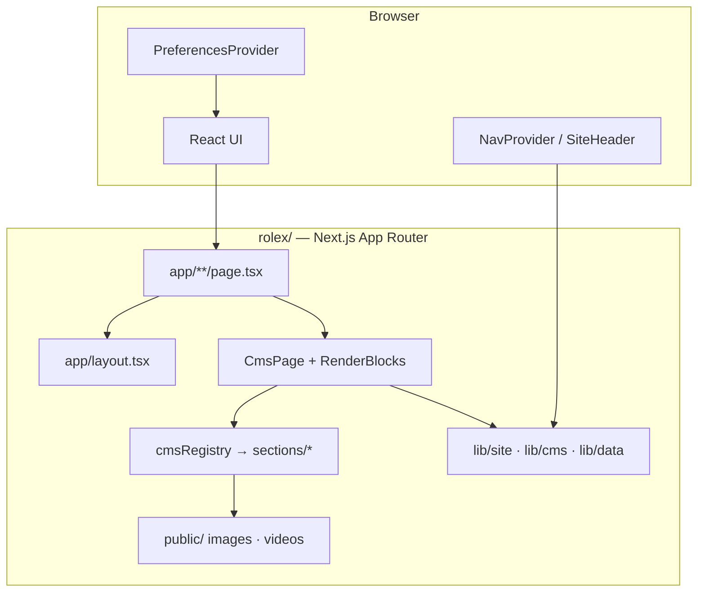
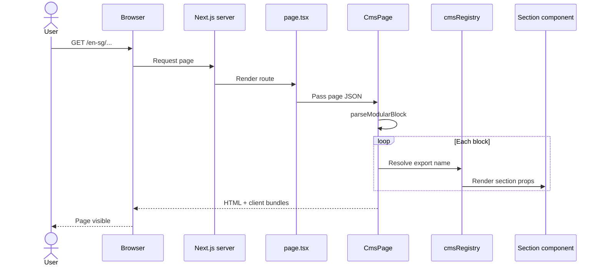
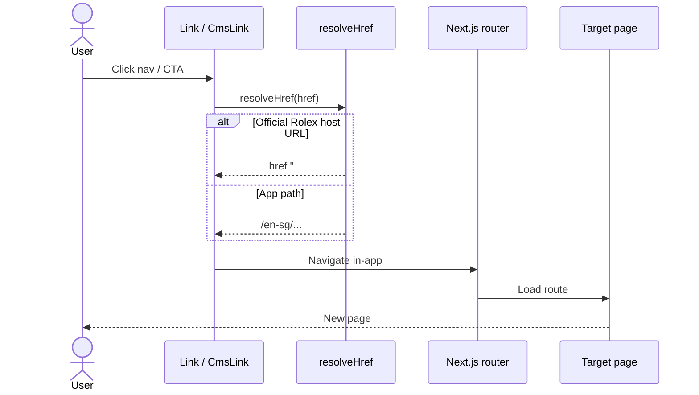

# Nawran — Rolex (SG)

Monorepo for the Singapore (`en-sg`) Rolex marketing frontend.

| Path | Role |
| --- | --- |
| [`rolex/`](./rolex/) | Next.js 16 app (run everything from here) |
| [`Backend/`](./Backend/) | Reserved for future API work (empty for now) |

Stack for the live app: **Bun · Next.js 16 · React 19 · TypeScript · Tailwind CSS 4 · GSAP · Framer Motion**. No Python.

---

## Prerequisites

Install these before setup:

| Tool | Version used here | Check |
| --- | --- | --- |
| [Bun](https://bun.sh) | 1.3.x | `bun --version` |
| Git | any recent | `git --version` |

Node is optional if Bun is installed (Bun runs the scripts).

---

## Setup (follow in order)

### 1. Clone and enter the app

```bash
cd Coding_projects/Nawran
cd rolex
```

### 2. Install dependencies

```bash
bun install
```

This creates / updates `node_modules` from `package.json` + `bun.lock`.

### 3. Environment file

```bash
# Windows (Git Bash / WSL) or macOS / Linux
cp .env.example .env
```

PowerShell:

```powershell
Copy-Item .env.example .env
```

| Variable | Purpose | Default |
| --- | --- | --- |
| `NEXT_PUBLIC_SITE_URL` | Absolute site URL for metadata | `http://localhost:3000` |

`.env` is gitignored. Keep secrets out of git. Only commit `.env.example`.

### 4. Start development

```bash
bun dev
```

Open [http://localhost:3000](http://localhost:3000).

Home also works at `/en-sg`.

### 5. Everyday commands

Run all of these from `rolex/`:

| Command | What it does |
| --- | --- |
| `bun dev` | Dev server with hot reload |
| `bun run build` | Production build |
| `bun start` | Serve the production build (after `build`) |
| `bun run lint` | ESLint |

### 6. Smoke check

After `bun dev`:

1. Home loads at `/` and `/en-sg`
2. Open menu / search from the top bar
3. Visit a collection page under `/en-sg/watches/...`
4. Wishlist at `/en-sg/wishlist`

---

## Activity diagram — first-time setup



---

## Activity diagram — browsing a CMS page



---

## System architecture



**How a CMS page is built**

1. A route under `app/en-sg/...` imports JSON from `lib/data/pages/`.
2. `CmsPage` flattens modular blocks (`parseModularBlock`).
3. `RenderBlocks` maps each `_content_type_uid` to a component in `components/sections/` via `cmsRegistry`.
4. `resolveHref` in `lib/site.ts` keeps navigation inside this app.

---

## Sequence diagram — first paint (CMS page)



---

## Sequence diagram — navigation click



---

## Project layout (`rolex/`)

```
rolex/
  app/                 # Routes, fonts, global CSS
  components/
    cms/               # Registry + page renderer
    sections/          # One component per CMS section
    navigation/        # Header, menus, search, languages
    layout/            # Footer
    media/             # Picture / video helpers
  lib/
    cms/               # Parse, types
    data/              # Header, footer, page JSON
    site.ts            # Locale, routes, link resolution
  public/              # Images, logos, videos
  .env.example         # Env template
```

### Main routes

| Path | Page |
| --- | --- |
| `/`, `/en-sg` | Home |
| `/en-sg/watches/new-watches/perpetual-padellone` | Perpetual Padellone |
| `/en-sg/watches/yacht-master-ii/m126688-0001` | Yacht-Master II |
| `/en-sg/watches/[slug]` | Watch collection |
| `/en-sg/watchmaking/a-unique-approach` | Watchmaking |
| `/en-sg/about-rolex/sustainable-development` | Sustainability |
| `/en-sg/wishlist` | Wishlist |
| `/en-sg/cart` | Cart |
| `/en-sg/get-in-touch` | Get in touch |

---

## Troubleshooting

| Problem | What to try |
| --- | --- |
| `bun: command not found` | Install Bun from https://bun.sh then reopen the terminal |
| Port 3000 in use | Stop the other process, or run `bun dev -- --port 3001` |
| Blank / wrong metadata URLs | Confirm `.env` has `NEXT_PUBLIC_SITE_URL=http://localhost:3000` and restart `bun dev` |
| Install errors | From `rolex/`, delete `node_modules` and run `bun install` again |
| Changes not showing | Hard refresh the browser; confirm you are editing files under `rolex/` |

---

## Notes

- Locale is fixed to **en-sg**.
- Package manager for this app is **Bun** (see `packageManager` in `rolex/package.json`).
- Next.js notes for agents: `rolex/AGENTS.md`.
